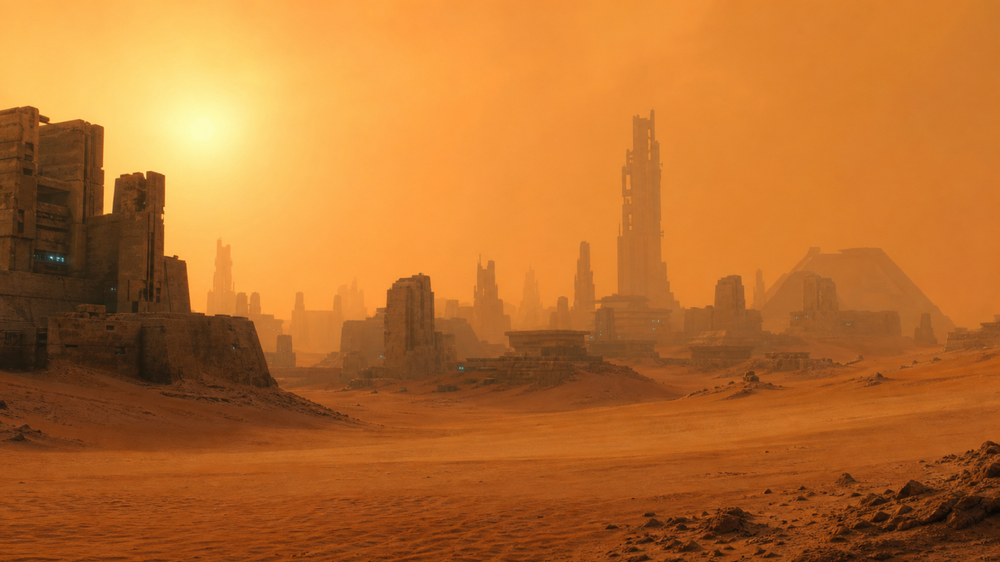
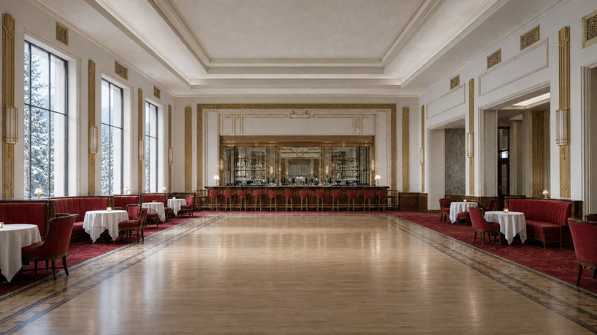

<!-- Dynamic Wallpaper -->

<p align="center">
  
</p>

<p align="center">
  
  
  
  
  
</p>

<p align="center">一個簡單的 <code>bash</code> 腳本，可透過 <b>cron 工作排程</b>依照目前時間設定桌布。</p>

 <br />

### 概覽

+ 25+[(更多)](https://github.com/adi1090x/files/tree/master/dynamic-wallpaper/wallpapers) 種不同類型的桌布組合（HD/UHD/4K/5K）。
+ 已加入 `pywal` 支援。
+ 使用者可以加入自己的桌布。
+ 搭配 `Cron` 時，桌布會在一天中依照時間變更。
+ 已測試於：
  - **`Window Managers`**：可在所有 window manager 上運作（已測試 Archcraft 內的所有 WM）
  - **`Wayland Compositors`**：`sway`、`wayfire`、`river`、`newm`、`hyprland`
  - **`Desktop Environments`**：`KDE`、`Pantheon`、`Gnome`、`Deepin`、`Cinnamon`、`XFCE`、`LXDE`、`MATE`、`Zorin`、`Budgie`

### 相依套件

使用 `dwall` 前，請先在系統上安裝以下程式：

- **`feh`**：用於在 WM 上設定桌布
- **`cron`**：用於替 dwall 建立排程工作
- **`xrandr`**：只有使用 XFCE 桌面時需要
- **`pywal`**：用於 pywal 支援（選用）

安裝 `feh`、`cron` 與 `xrandr`：
```bash
# On Archlinux
$ sudo pacman -Sy xorg-xrandr feh cronie

# On Ubuntu or Debian
$ sudo apt-get install x11-xserver-utils feh cron
```

> 若要支援 swaywm，使用者必須安裝 [oguri](https://github.com/vilhalmer/oguri)。腳本需要先啟動 `oguri` daemon 才能運作。`Oguri` 可透過 Arch Linux 的 [AUR](https://aur.archlinux.org/packages/oguri-git/) 安裝。

### 安裝

依照以下步驟將 `dwall` 安裝到系統：
> 安裝到系統前，可以先執行 `test.sh` 測試。

+ Clone 此 repository：
```
$ git clone https://github.com/adi1090x/dynamic-wallpaper.git
```

+ 進入 clone 下來的目錄並執行 `install.sh`：
```
$ cd dynamic-wallpaper
$ chmod +x install.sh
$ ./install.sh
```

### 執行程式

+ 開啟終端機並執行 `dwall`：
```
$ dwall

╺┳┓╻ ╻┏┓╻┏━┓┏┳┓╻┏━╸   ╻ ╻┏━┓╻  ╻  ┏━┓┏━┓┏━┓┏━╸┏━┓
 ┃┃┗┳┛┃┗┫┣━┫┃┃┃┃┃     ┃╻┃┣━┫┃  ┃  ┣━┛┣━┫┣━┛┣╸ ┣┳┛
╺┻┛ ╹ ╹ ╹╹ ╹╹ ╹╹┗━╸   ┗┻┛╹ ╹┗━╸┗━╸╹  ╹ ╹╹  ┗━╸╹┗╸

Dwall V3.0   : Set wallpapers according to current time.
Developed By : Aditya Shakya (@adi1090x)

Usage : test.sh [-h] [-p] [-s style]

Options:
   -h	  Show this help message
   -p	  Use pywal to set wallpaper
   -s	  Name of the style to apply

Available styles:  alien-horror  aurora  beach  bitday  chihuahuan  cliffs  colony  desert  earth  exodus
factory  firewatch  forest  gradient  home  island  kyoto  lake  lakeside  market  mojave  moon
mountains  neon-dystopia  room  sahara  street  tokyo  uji  winter-overlook

Examples:
test.sh -s beach       Set wallpaper from 'beach' style
test.sh -p -s sahara   Set wallpaper from 'sahara' style using pywal
```

+ 選擇你喜歡的樣式後執行：
```
$ dwall -s firewatch
[*] Using style : firewatch
```

### 設定 cron 工作

這個程式是為了搭配 **cron** 或 **systemd/Timers** 這類時間排程工具而設計。安裝完成後，需要在系統上用 `crontab` 建立排程工作。依照以下步驟設定：
> 這裡以 Arch Linux 上的 `cronie` 為例。

- 安裝 `cron` 後，啟用並啟動 cron 服務：
```bash
# On Arch Linux
$ sudo systemctl enable cronie.service --now
```

- 確認服務已啟用且正在執行：
```
$ systemctl status cronie.service
● cronie.service - Periodic Command Scheduler
     Loaded: loaded (/usr/lib/systemd/system/cronie.service; enabled; vendor preset: disabled)
     Active: active (running) since Sat 2020-12-26 14:39:31 IST; 5h 22min ago
   Main PID: 779 (crond)
```

- Cron 不會在 Xorg server 下執行，因此它不知道啟動 Xorg 應用程式所需的環境變數。你需要先找出以下環境變數的值：`SHELL`、`PATH`、`DISPLAY`、`DESKTOP_SESSION`、`DBUS_SESSION_BUS_ADDRESS`、`XDG_RUNTIME_DIR`
```
$ echo "$SHELL | $PATH | $DISPLAY | $DESKTOP_SESSION | $DBUS_SESSION_BUS_ADDRESS | $XDG_RUNTIME_DIR"

/usr/bin/zsh | /usr/local/bin:/usr/bin | :0 | Openbox | unix:path=/run/user/1000/bus | /run/user/1000
```

- 接著使用 `crontab` 建立每小時執行一次的 **dwall** 工作：
```bash
# export editor for crontab
$ export EDITOR=vim

# Edit your crontab and add a job
$ crontab -e

# Add this line replacing the values of env variable and style with yours
0 * * * * env PATH=/usr/local/bin:/usr/bin DISPLAY=:0 DESKTOP_SESSION=Openbox DBUS_SESSION_BUS_ADDRESS="unix:path=/run/user/1000/bus" /usr/bin/dwall -s firewatch

# check if job is created on your crontab
$ crontab -l
0 * * * * env PATH=/usr/local/bin:/usr/bin DISPLAY=:0 DESKTOP_SESSION=Openbox DBUS_SESSION_BUS_ADDRESS="unix:path=/run/user/1000/bus" /usr/bin/dwall -s firewatch
```

- 在 Linux Mint 22.3 搭配 Cinnamon 與 X11 時，將 session 相關環境變數定義在 crontab 上方會更可靠。以下範例使用 checkout 內的 `dwall.sh`，將 log 寫到 `/tmp/dwall-cron.log`，每小時更新一次，並在重開機後重新套用桌布：
```bash
SHELL=/bin/bash
PATH=/usr/local/bin:/usr/bin:/bin
HOME=/home/xsmbradpitt
DISPLAY=:0
DESKTOP_SESSION=cinnamon
DBUS_SESSION_BUS_ADDRESS=unix:path=/run/user/1001/bus
XDG_RUNTIME_DIR=/run/user/1001
XDG_SESSION_TYPE=x11

0 * * * * /home/xsmbradpitt/source/repos/github/dynamic-wallpaper/dwall.sh -s neon-dystopia >> /tmp/dwall-cron.log 2>&1

@reboot sleep 20 && /home/xsmbradpitt/source/repos/github/dynamic-wallpaper/dwall.sh -s neon-dystopia >> /tmp/dwall-cron.log 2>&1
```

- 完成後，**dwall** 就會加入你的 crontab，並每小時變更一次桌布。如果想改用其他桌布樣式，只要移除原本的工作，再加入新的樣式即可。
```bash
# delete previous job
$ crontab -r

# Add new job with different style
$ crontab -e
0 * * * * env PATH=/usr/local/bin:/usr/bin DISPLAY=:0 DESKTOP_SESSION=Openbox DBUS_SESSION_BUS_ADDRESS="unix:path=/run/user/1000/bus" /usr/bin/dwall -s bitday
```

### 如何加入自己的桌布

+ 下載你喜歡的桌布組合。
+ 將桌布重新命名為 `0-23`（必須是 **jpg/png**）。如果圖片數量不足，可以用 symlink 補齊。
+ 在 `/usr/share/dynamic-wallpaper/images` 中建立一個目錄，並將桌布複製進去。
+ 執行程式，選擇樣式並套用。

**`提示`**
- 你可以用 `dwall` 在不同喜愛桌布之間每小時切換。
- 你也可以把 `dwall` 當成圖片輪播，每小時或每 15 分鐘套用一次喜愛的照片。只要建立適合的 cron 工作即可。

### 使用 HEIC 圖片

你可能也會想使用 [Dynamic Wallpaper Club](https://dynamicwallpaper.club/) 上的桌布。若要使用，需要先將 `.heic` 圖片轉換為 png 或 jpg 格式。下載喜歡的 `.heic` 桌布檔後，依照以下步驟轉換圖片。

- 先在系統上安裝 `heif-convert`：
```bash
# On Archlinux
$ sudo pacman -Sy libheif

# On Ubuntu or Debian
$ sudo apt-get install libheif-examples

```

- 將 `.heic` 檔案移到同一個目錄中，然後執行以下指令轉換圖片：
```bash
# change to directory
$ cd Downloads/heic_images

# convert to jpg images
$ for file in *.heic; do heif-convert $file ${file/%.heic/.jpg}; done
```

- 現在你已經有轉換後的圖片，只要照著[上方](https://github.com/adi1090x/dynamic-wallpaper#How-to-add-own-wallpapers)的步驟，就可以用 `dwall` 套用這些桌布。

**更多桌布：** 我也製作了一些沒有加入此 repository 的桌布組合，因為檔案大小較大。你可以從這裡下載這些桌布組合：
<p align="center">
  <a href="https://github.com/adi1090x/files/tree/master/dynamic-wallpaper/wallpapers"></a>
</p>

**`可用組合`**：`Catalina`、`London`、`Maldives`、`Mojave HD`、`Mount Fuji`、`Seoul`，以及更多。

### 預覽

|Aurora|Beach|Bitday|Chihuahuan|
|--|--|--|--|
|||||

|Cliffs|Colony|Desert|Earth|
|--|--|--|--|
|||||

|Exodus|Factory|Forest|Gradient|
|--|--|--|--|
|||||

|Home|Island|Lake|Lakeside|
|--|--|--|--|
|||||

|Market|Mojave|Moon|Mountains|
|--|--|--|--|
|||||

|Room|Sahara|Street|Tokyo|
|--|--|--|--|
|||||

<table>
  <tr>
    <td><strong>Alien Horror</strong></td>
    <td><strong>Kyoto</strong></td>
    <td><strong>Neon Dystopia</strong></td>
    <td><strong>Uji</strong></td>
    <td><strong>Winter Overlook</strong></td>
  </tr>
  <tr>
    <td></td>
    <td></td>
    <td></td>
    <td></td>
    <td></td>
  </tr>
</table>

### 常見問題

**1. 桌布沒有變更**：如果桌布沒有變更，請開 issue 並提供 `echo $DESKTOP_SESSION` 的輸出。

**2. 在 XFCE 上無法運作**：如果這個腳本在 xfce 上無法運作，請開啟終端機並執行 `xfconf-query -c xfce4-desktop -m`，然後透過 *xfce4-settings-manager* 變更任一桌布。<br />
在終端機中，*xfconf-query* 會印出以 `set:` 開頭的行，這些行會顯示哪些屬性被變更。請檢查 `screen` 與 `monitor` 的值，並相應修改腳本。
```bash
109   ## For XFCE
110   if [[ "$OSTYPE" == "linux"* ]]; then
111      SCREEN="0"
112      MONITOR="1"
113   fi

```

3. **自動啟動**：如果想在桌面啟動時自動啟動腳本，可以將它加入 WM 的 autostart 檔案；如果這對你無效，也可以在 `$HOME/.config/autostart` 目錄中建立 `desktop file`。
```bash
$ cd $HOME/.config/autostart && touch dwall.desktop

# Add this to dwall.desktop file

[Desktop Entry]
Name=Dynamic Wallpaper
Comment=Set desktop background according to current time.
Exec=/usr/bin/dwall -s firewatch &
Type=Application
Icon=wallpaper
Categories=Accessories;
```
> 或者，你也可以將 `/usr/bin/dwall -s firewatch &` 指令放到 `~/.bashrc` 檔案中。

### 快速提醒

+ 在 KDE 中，`dwall` 會變更所有 Activities 的桌布。
+ 搭配 `pywal` 使用時，其他應用程式（Terminal、polybar、rofi 等）的顏色會依照你對這些應用程式的設定而變更。這取決於你的設定。
+ 你可以將 **`dwall -s style &`** 加入 WM 的 autostart 檔案，以便登入或重開機後設定/還原桌布。
+ 你也可以建立 `@reboot` crontab，在開機時設定適合的桌布。
